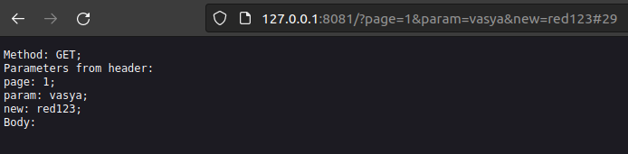
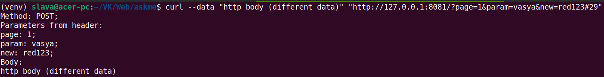

### 2. Создание простого WSGI-скрипта
Отдельно от вашего приложение создать простой WSGI-скрипт (функция или класс). Этот скрипт должен:
- зупускаться с помощью gunicorn;
- выводить список переданных **GET** и **POST** параметров;
- выполняеться при запросе **localhost:8081**;
- работать без использования Django.

Из директории simple_wsgi_script запустить команду:

gunicorn -c gunicorn.conf.py output_params_wsgi:application

Тест GET запроса в браузере:

Тест POST запроса c помощью curl:

